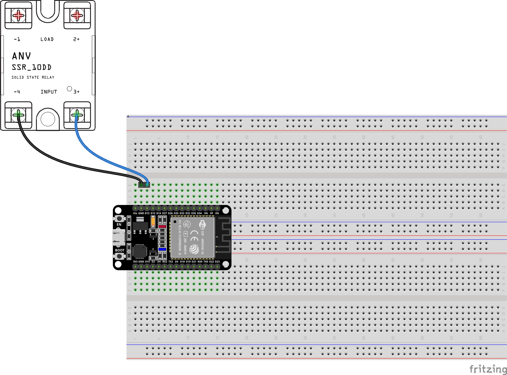

# daylight

All this project does is that at sunrise it switches on the SSR relay for 230 V and at sunset it switches it off using DOIT ESP32 DEVKIT v1. I use this to automatically turn the terrarium on and off.

## Sketch

